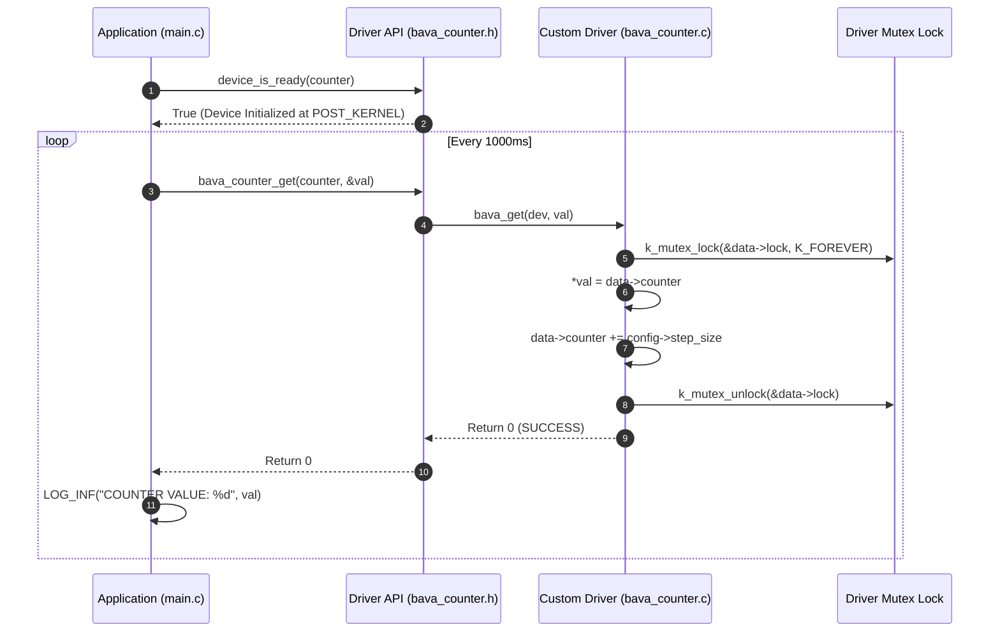

# Zephyr RTOS Custom Counter Device Driver (`bava_counter_driver`)

This project demonstrates how to build a **Custom Out-of-Tree Device Driver** in Zephyr RTOS with custom Devicetree bindings (`.yaml`), custom driver C APIs, mutex thread safety, and instantiating driver device structures using `DT_INST_FOREACH_STATUS_OKAY` and `DEVICE_DT_INST_DEFINE`.

---

## Overview

Zephyr RTOS provides a powerful, unified device driver model. While Zephyr includes standard drivers for built-in SoC peripherals, real-world embedded applications often require writing **Custom Out-of-Tree Drivers** for proprietary hardware or custom logic. This demo showcases:
- **Devicetree Binding Specification (`dts/bindings/counter/bava,counter.yaml`)**: Defining custom node properties (`start-offset`, `step-size`) for compatible string `"bava,counter"`.
- **Custom Driver API Architecture (`include/drivers/bava_counter.h`)**: Defining C function pointer tables (`struct bava_counter_api`) for `get` and `reset` functions.
- **Driver Instantiation & Mutex Synchronization (`drivers/.../bava_counter.c`)**: Initializing mutex locks per instance, setting starting counters, and processing dynamic step increments inside thread-safe critical sections.
- **Application Interface (`src/main.c`)**: Accessing the custom driver instance via `DEVICE_DT_GET(DT_NODELABEL(fast_counter))` and invoking driver API methods.

---

## Directory Structure

```text
bava_counter_driver/
├── CMakeLists.txt     # Top-level CMake build rules linking out-of-tree driver sources
├── prj.conf           # Kconfig options (Zephyr Logger, Serial Console)
├── app.overlay        # Devicetree overlay instantiating the bava,counter device node
├── README.md          # Topic documentation & design analysis
├── include/
│   └── drivers/
│       └── bava_counter.h # Custom driver public API header
├── dts/
│   └── bindings/
│       └── counter/
│           └── bava,counter.yaml # Devicetree binding specification
├── drivers/
│   └── counter/
│       └── bava_counter/
│           ├── CMakeLists.txt
│           └── bava_counter.c    # Custom driver implementation & DT_INST instantiation
└── src/
    └── main.c         # Application code consuming the custom counter driver
```

---

## Architecture & System Flow



---

## Key Technical Features & APIs Used

### 1. Devicetree Binding (`bava,counter.yaml`)
```yaml
description: Custom counter driver for learning Zephyr RTOS
compatible: bava,counter
include: [base.yaml]

properties:
  start-offset:
    type: int
    required: true
    description: Initial integer counter starting value
  step-size:
    type: int
    required: false
    default: 1
    description: Step size increment per get() operation
```

### 2. Devicetree Overlay Node (`app.overlay`)
```dts
/{
    soc {
        fast_counter: counter_fast {
            compatible = "bava,counter";
            start-offset = <100>;
            step-size = <5>;
            status = "okay";
        };
    };
};
```

### 3. Driver C Implementation (`bava_counter.c`)
- **Compatibility Macro**: `#define DT_DRV_COMPAT bava_counter`
- **Instance Definition Macro**:
  ```c
  #define BAVA_COUNTER_DEFINE(inst) \
      static const struct bava_counter_config config_##inst = { \
          .start_offset = DT_INST_PROP(inst, start_offset), \
          .step_size = DT_INST_PROP_OR(inst, step_size, 1), \
      }; \
      static struct bava_counter_data data_##inst; \
      DEVICE_DT_INST_DEFINE( \
          inst, \
          bava_counter_init, \
          NULL, \
          &data_##inst, \
          &config_##inst, \
          POST_KERNEL, \
          CONFIG_KERNEL_INIT_PRIORITY_DEVICE, \
          &bava_api \
      );

  DT_INST_FOREACH_STATUS_OKAY(BAVA_COUNTER_DEFINE)
  ```

---

## Analysis of Resolved Build & Code Errors

| File / Component | Initial Error / Issue | Impact | Corrective Action |
| :--- | :--- | :--- | :--- |
| `CMakeLists.txt:7` | Missing `find_package(Zephyr)` before `zephyr_include_directories` | CMake error: `Unknown CMake command "zephyr_include_directories"` | Added `find_package(Zephyr REQUIRED HINTS $ENV{ZEPHYR_BASE})` prior to Zephyr macros. |
| `prj.conf:7` | Typo: `CONFIG_MULTIPTHREADING=y` | Kconfig syntax error | Corrected to `CONFIG_MULTITHREADING=y`. |
| `bava_counter.h:30` | Pointer dereference error: `*api = (const struct bava_counter_api*)dev->api;` | C Compiler Error | Fixed assignment: `api = (const struct bava_counter_api *)dev->api;`. |
| `bava_counter.c:1` | Typo: `#define DT_DRV_COMPACT bava_counter` | DT macro definition fail | Fixed macro name to `#define DT_DRV_COMPAT bava_counter`. |
| `bava_counter.c:67` | Calling `device_is_ready(dev)` inside driver `init()` | Initialization failure (device not ready during init) | Removed `device_is_ready(dev)` inside its own init routine. |
| `src/main.c:18` | Uninitialized pointer `int* val;` passed to driver API | Wildcard memory dereference fault | Changed to stack variable `int val = 0;` and passed `&val`. |

---

## How to Build and Run

From the root of your Zephyr RTOS workspace:

### 1. Build for QEMU Simulator (`qemu_cortex_m3`)
```bash
west build -p always -b qemu_cortex_m3 bava_counter_driver
```

### 2. Run in QEMU Simulator
```bash
west build -t run
```

---

## Expected Output

```text
*** Booting Zephyr OS build v3.7.0 ***
[00:00:00.000,000] <inf> main_app: STARTED........
[00:00:00.000,000] <inf> main_app: COUNTER VALUE: 100
[00:00:01.000,000] <inf> main_app: COUNTER VALUE: 105
[00:00:02.000,000] <inf> main_app: COUNTER VALUE: 110
[00:00:03.000,000] <inf> main_app: COUNTER VALUE: 115
```
