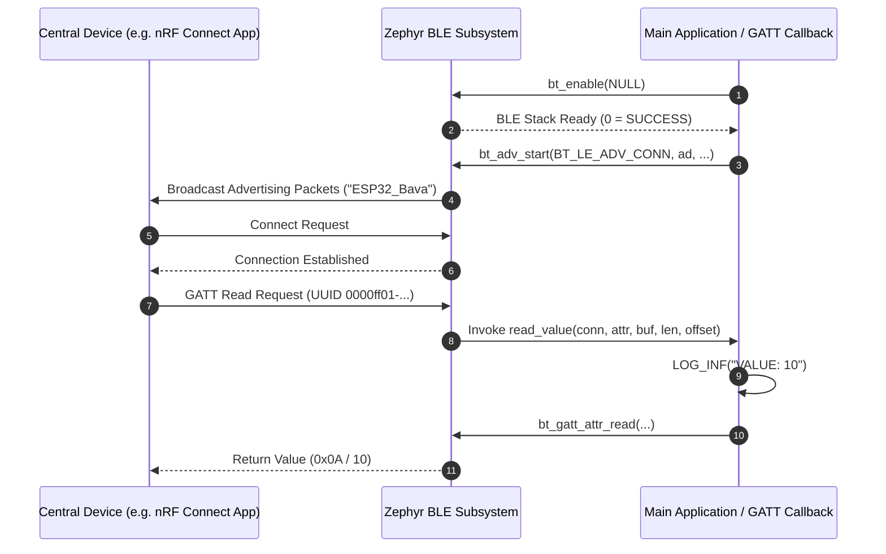

# Zephyr RTOS Bluetooth Low Energy (BLE) Peripheral Demo (`ble`)

This project demonstrates **Bluetooth Low Energy (BLE) Peripheral Role Operations** and **Custom GATT Service Definition** in Zephyr RTOS using the Zephyr Bluetooth Host Stack APIs (`<zephyr/bluetooth/bluetooth.h>`, `gatt.h`, `uuid.h`).

---

## Overview

Bluetooth Low Energy (BLE) is the standard wireless protocol for short-range, low-power communication between microcontrollers (Peripherals) and smartphones or gateways (Centrals). This demo showcases:
- **BLE Host Stack Initialization**: Initializing the Zephyr BLE controller/host stack with `bt_enable()`.
- **Connectable LE Advertising**: Broadcasting discoverable LE advertising packets (`BT_LE_ADV_CONN`) carrying device name `"ESP32_Bava"`.
- **Custom 128-bit GATT Service & Characteristic**: Defining a primary service and a readable characteristic using custom 128-bit UUIDs and macro static definition (`BT_GATT_SERVICE_DEFINE`).
- **GATT Read Callback Execution**: Serving characteristic read requests from connected Central devices via `bt_gatt_attr_read`.

---

## Directory Structure

```text
ble/
├── CMakeLists.txt     # CMake build system rules
├── prj.conf           # Kconfig options (Bluetooth stack enablement, Peripheral role, Device name)
├── app.overlay        # Devicetree overlay (Default/empty)
├── README.md          # Topic documentation & design analysis
└── src/
    └── main.c         # BLE stack setup, GATT service definition & advertising loop
```

---

## Architecture & System Flow



---

## Key Technical Features & APIs Used

### 1. Custom 128-bit UUID Encoding
Encodes vendor-specific 128-bit UUIDs for custom services and characteristics:
```c
#define BT_UUID_CUSTOM_SERVICE_VAL BT_UUID_128_ENCODE(0x0000ff00, 0x0000, 0x1000, 0x8000, 0x00805f9b34fb)
#define BT_UUID_VALUE_CHRC_VAL     BT_UUID_128_ENCODE(0x0000ff01, 0x0000, 0x1000, 0x8000, 0x00805f9b34fb)

static struct bt_uuid_128 service_uuid = BT_UUID_INIT_128(BT_UUID_CUSTOM_SERVICE_VAL);
static struct bt_uuid_128 value_uuid   = BT_UUID_INIT_128(BT_UUID_VALUE_CHRC_VAL);
```

### 2. Static GATT Service Registration (`BT_GATT_SERVICE_DEFINE`)
Statically registers GATT attributes directly into firmware flash memory without dynamic heap allocations:
```c
BT_GATT_SERVICE_DEFINE(my_service,
    BT_GATT_PRIMARY_SERVICE(&service_uuid),

    BT_GATT_CHARACTERISTIC(&value_uuid.uuid,
                           BT_GATT_CHRC_READ,
                           BT_GATT_PERM_READ,
                           read_value, 
                           NULL, 
                           NULL)
);
```

### 3. GATT Read Attribute Callback
Responds to incoming GATT read requests from connected central devices:
```c
static uint8_t value = 10;

static ssize_t read_value(struct bt_conn *conn, const struct bt_gatt_attr *attr,
                           void *buf, uint16_t len, uint16_t offset)
{
    LOG_INF("VALUE: %d", value);
    return bt_gatt_attr_read(conn, attr, buf, len, offset, &value, sizeof(value));
}
```

### 4. Bluetooth LE Advertising Configuration
Broadcasting advertising packets containing discoverability flags and full device name:
```c
static const struct bt_data ad[] = {
    BT_DATA_BYTES(BT_DATA_FLAGS, (BT_LE_AD_GENERAL | BT_LE_AD_NO_BREDR)),
    BT_DATA(BT_DATA_NAME_COMPLETE, "ESP32_Bava", sizeof("ESP32_Bava") - 1),
};

/* Start advertising */
bt_adv_start(BT_LE_ADV_CONN, ad, ARRAY_SIZE(ad), NULL, 0);
```

---

## Kconfig Configuration (`prj.conf`)

- `CONFIG_BT=y`: Enables Zephyr Bluetooth subsystem stack.
- `CONFIG_BT_PERIPHERAL=y`: Configures node in BLE Peripheral (connectable slave) role.
- `CONFIG_BT_DEVICE_NAME="ESP32_Bava"`: Sets local Bluetooth device name string.
- `CONFIG_BT_DEVICE_APPEARANCE=0`: Generic appearance category.
- `CONFIG_LOG=y`, `CONFIG_LOG_DEFAULT_LEVEL=3`: Enables Zephyr Logger framework at `LOG_LEVEL_INF`.

---

## How to Build and Run

From the root of your Zephyr RTOS workspace:

### 1. Build for BLE Hardware Target (e.g. ESP32 / nRF52840 / STM32WB)
```bash
west build -p always -b esp32_devkitc_wroom ble
```
or
```bash
west build -p always -b nrf52840dk_nrf52840 ble
```

### 2. Flash to Hardware Target
```bash
west flash
```

---

## Expected Behavior & Testing with Smartphone

1. **Bootup**:
   ```text
   *** Booting Zephyr OS build v3.5.0 ***
   [00:00:00.000,000] <inf> bt_hci_core: HW Platform: Nordic Semiconductor
   [00:00:00.000,000] <inf> bt_hci_core: Identity: XX:XX:XX:XX:XX:XX (random)
   [00:00:00.000,000] <inf> bt_hci_core: Bluetooth initialized
   ```
2. **Scanner Discovery**: Open a BLE scanner application (e.g. **nRF Connect** for iOS/Android or LightBlue).
3. **Connect & Read**:
   - Locate device `"ESP32_Bava"`.
   - Tap **Connect**.
   - Expand Custom Service (`0000ff00-0000-1000-8000-00805f9b34fb`).
   - Read Characteristic (`0000ff01-0000-1000-8000-00805f9b34fb`).
   - The app displays value `0x0A` (`10`), and serial output logs `[00:00:XX.XXX] <inf> app: VALUE: 10`.
