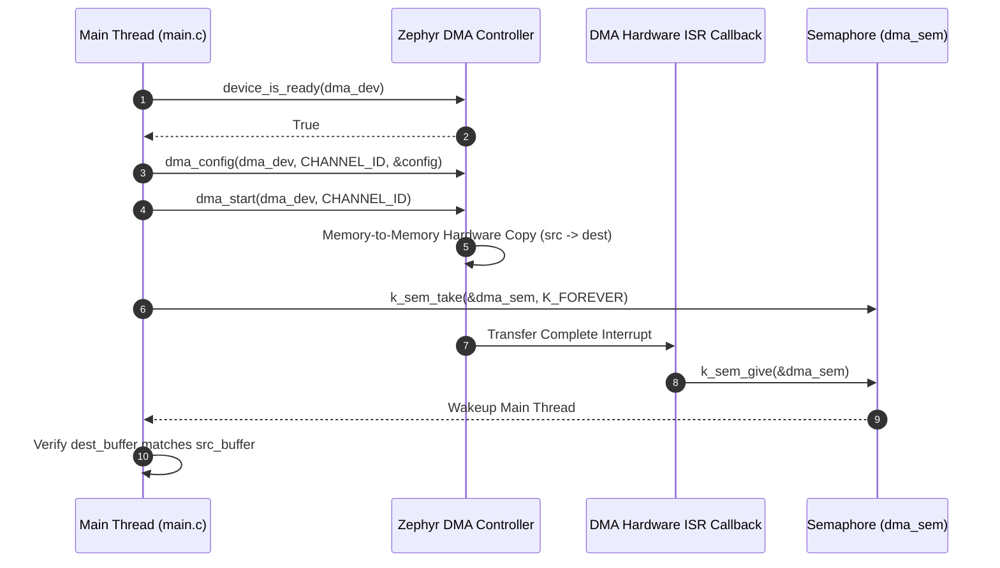

# Zephyr RTOS Direct Memory Access (DMA) Demo (`dma`)

This project demonstrates **Direct Memory Access (DMA)** in Zephyr RTOS using Devicetree aliases (`i2c`/`dma`), memory-to-memory block transfers (`dma_block_config`), asynchronous transfer callbacks, and binary semaphore (`k_sem`) thread synchronization.

---

## Overview

Direct Memory Access (DMA) allows hardware subsystems to transfer data directly between memory locations or peripherals without involving the main CPU core for every byte. This demo showcases:
- **Asynchronous Memory-to-Memory Copy**: Offloading a 64-byte array transfer from source to destination buffer directly to the DMA controller.
- **ISR Transfer Completion Callback**: Receiving non-blocking hardware interrupt callbacks (`dma_callback`) upon transfer completion and giving a semaphore (`k_sem_give(&dma_sem)`).
- **Thread Synchronization & Data Verification**: Blocking the caller thread until the DMA ISR completes (`k_sem_take`), followed by a byte-for-byte memory verification check.

---

## Directory Structure

```text
dma/
├── CMakeLists.txt     # CMake build rules for the DMA application
├── prj.conf           # Kconfig options (DMA subsystem enablement & Logger)
├── app.overlay        # Devicetree overlay enabling & aliasing the DMA controller
├── README.md          # Topic documentation & design analysis
└── src/
    └── main.c         # DMA block config, callback ISR, semaphore sync & verification
```

---

## Architecture & System Flow



---

## Key Technical Features & APIs Used

### 1. Devicetree Overlay Configuration (`app.overlay`)
Enables the target hardware DMA controller node and aliases it to `dma`:
```dts
&dma1 {
    status = "okay";
};

/ {
    aliases {
        dma = &dma1;
    };
};
```

### 2. DMA Block Configuration (`struct dma_block_config`)
Configures source/destination buffer addresses, transfer block size, and memory address incrementing rules:
```c
struct dma_block_config block_config = {
    .source_address = (uint32_t)(uintptr_t)src_buffer,
    .dest_address = (uint32_t)(uintptr_t)dest_buffer,
    .block_size = BUFFER_SIZE,
    .source_addr_adj = DMA_ADDR_ADJ_INCREMENT,
    .dest_addr_adj = DMA_ADDR_ADJ_INCREMENT,
    .next_block = NULL,
};
```

### 3. DMA Channel Configuration (`struct dma_config`)
Configures channel properties, memory-to-memory direction, data width (1 byte), burst length, and completion ISR callback:
```c
struct dma_config config = {
    .channel_direction = MEMORY_TO_MEMORY,
    .source_data_size = 1,
    .dest_data_size = 1,
    .source_burst_length = 1,
    .dest_burst_length = 1,
    .dma_callback = dma_callback,
    .user_data = NULL,
    .block_count = 1,
    .head_block = &block_config,
    .complete_callback_en = 1,
};

dma_config(dma_dev, CHANNEL_ID, &config);
dma_start(dma_dev, CHANNEL_ID);
```

### 4. Asynchronous Interrupt Callback (`dma_callback`)
```c
static void dma_callback(const struct device *dev, void *user_data,
                         uint32_t channel_id, int status)
{
    if (status >= 0) {
        LOG_INF("Data transfer successful");
    } else {
        LOG_ERR("Data transfer failed %d", status);
    }
    k_sem_give(&dma_sem);
}
```

---

## Code Analysis & Simple Bug Fixes Applied

| File / Line | Issue Description | Impact | Corrective Fix |
| :--- | :--- | :--- | :--- |
| `src/main.c:69` | **Variable Typo**: `.head_block = &block_cfg,` | Compilation error (`block_cfg` undeclared). | Corrected reference to `&block_config`. |
| `src/main.c:60` | **Invalid Struct Member**: `.dma_channel = CHANNEL_ID,` inside `struct dma_config` | Compilation error (`struct dma_config` has no member named `dma_channel`). | Removed invalid field (channel ID is passed directly to `dma_config()` API). |
| `src/main.c:51-52` | 64-bit Pointer Cast Warning: `(uint32_t)src_buffer` | Compiler warning on 64-bit platforms. | Updated cast to `(uint32_t)(uintptr_t)src_buffer`. |
| `app.overlay:1-5` | Missing `status = "okay"` on `&dma1` | Runtime error: controller disabled. | Set `status = "okay"` on controller node. |

---

## Kconfig Configuration (`prj.conf`)

- `CONFIG_DMA=y`: Enables Zephyr core DMA driver subsystem.
- `CONFIG_LOG=y`, `CONFIG_LOG_DEFAULT_LEVEL=3`: Enables Zephyr Logger at `LOG_LEVEL_INF`.
- `CONFIG_SERIAL=y`, `CONFIG_CONSOLE=y`, `CONFIG_UART_CONSOLE=y`: Serial console logging.

---

## How to Build and Run

From the root of your Zephyr RTOS workspace:

### 1. Build for Supported Hardware Board (e.g. STM32F4 Discovery)
```bash
west build -p always -b stm32f4_disco dma
```

### 2. Flash to Target Hardware
```bash
west flash
```

---

## Expected Output

Serial terminal log output upon booting:

```text
*** Booting Zephyr OS build v3.7.0 ***
[00:00:00.000,000] <inf> dma_demo: DMA started. Waiting for ISR completion callback...
[00:00:00.001,000] <inf> dma_demo: Data transfer successful
[00:00:00.001,000] <inf> dma_demo: Data verification passed!
```
