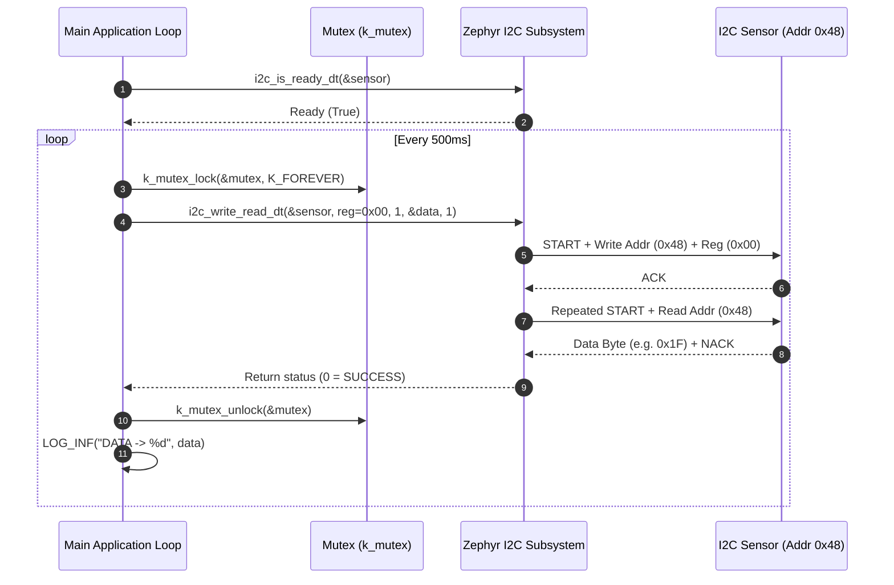

# Zephyr RTOS I2C Sensor & Register Communication Demo (`i2c`)

This project demonstrates **I2C Bus Communication** and **Register Reading** in Zephyr RTOS using Devicetree overlays (`i2c_dt_spec`), thread-safe bus synchronization via **Mutexes (`k_mutex`)**, and the high-level `i2c_write_read_dt` driver API.

---

## Overview

In embedded systems, Inter-Integrated Circuit (I2C) is one of the most widely used serial communication protocols for interfacing with sensors, EEPROMs, and power management ICs. This demo showcases:
- **Devicetree Hardware Abstraction**: Binding an I2C slave device (temperature sensor at slave address `0x48`) to an I2C controller (`&i2c0`) operating at fast clock bitrate (`400 kHz`).
- **Thread-Safe Bus Transactions**: Wrapping I2C bus access inside a `k_mutex` critical section to prevent bus contention when accessed across multiple threads.
- **Combined Write-Read Operations**: Using `i2c_write_read_dt` to send a target register address (`0x00`) followed immediately by a repeated START and data read transaction.

---

## Directory Structure

```text
i2c/
├── CMakeLists.txt     # CMake build rules for the I2C application
├── prj.conf           # Kconfig options (I2C driver, Zephyr Logger subsystem)
├── app.overlay        # Devicetree overlay defining I2C bus & sensor slave address
├── README.md          # Topic documentation & design analysis
└── src/
    └── main.c         # I2C driver initialization, thread-safe register read & loop
```

---

## Architecture & System Flow



---

## Key Technical Features & APIs Used

### 1. Devicetree Bus & Node Overlay (`app.overlay`)
The overlay configures the `&i2c0` bus controller and attaches a child temperature sensor node at address `0x48`:
```dts
/{
    aliases {
        temperature = &temp_sensor;
    };
};

&i2c0 {
    status = "okay";
    clock-frequency = <I2C_BITRATE_FAST>;

    temp_sensor: temperature_sensor@48 {
        compatible = "i2c_device";
        reg = <0x48>;
        label = "temperature_sensor";
    };
};
```

### 2. Devicetree Specification Retrieval (`i2c_dt_spec`)
Rather than hardcoding bus names and slave addresses in C code, `I2C_DT_SPEC_GET` extracts both from Devicetree at compile time:
```c
#define TEMP DT_ALIAS(temperature)
static const struct i2c_dt_spec sensor = I2C_DT_SPEC_GET(TEMP);
```
- `sensor.bus`: Pointer to the parent `&i2c0` device structure.
- `sensor.addr`: Configured 7-bit slave address (`0x48`).

### 3. Thread-Safe Register Read (`i2c_write_read_dt`)
Performs a combined transaction (Write register index $\rightarrow$ Repeated START $\rightarrow$ Read data byte) protected by a kernel mutex:
```c
K_MUTEX_DEFINE(mutex);

int read_register(uint8_t reg1, uint8_t *data)
{
    int ret;
    k_mutex_lock(&mutex, K_FOREVER);
    
    /* Write 1 byte (register address), then read 1 byte into data */
    ret = i2c_write_read_dt(&sensor, &reg1, 1, data, 1);
    
    k_mutex_unlock(&mutex);
    return ret;
}
```

---

## Kconfig Configuration (`prj.conf`)

- `CONFIG_I2C=y`: Enables the Zephyr I2C driver subsystem and core APIs.
- `CONFIG_LOG=y`: Enables the Zephyr Logging framework.
- `CONFIG_LOG_MODE_IMMEDIATE=y`: Outputs log records synchronously.
- `CONFIG_LOG_DEFAULT_LEVEL=3`: Sets default log level to `LOG_LEVEL_INF`.
- `CONFIG_MULTITHREADING=y`: Enables kernel multithreading services.

---

## How to Build and Run

From the root of your Zephyr RTOS workspace:

### 1. Build for Physical Target Hardware (e.g., STM32 / ESP32 / nRF52)
```bash
west build -b <your_board_name> i2c -p always
```

### 2. Build for QEMU Simulator (with I2C Emulation Support)
```bash
west build -b qemu_cortex_m3 i2c -p always
west build -t run
```

### 3. Flash to Physical Hardware
```bash
west flash
```

---

## Expected Terminal Output

When flashed onto a board with an active I2C peripheral sensor connected at address `0x48`:

```text
*** Booting Zephyr OS build v3.5.0 ***
[00:00:00.000,000] <inf> app: I2C communication test...
[00:00:00.000,000] <inf> app: SENSOR ADDR -> 0x48
[00:00:00.000,000] <inf> app: DATA -> 25
[00:00:00.500,000] <inf> app: DATA -> 25
[00:00:01.000,000] <inf> app: DATA -> 26
[00:00:01.500,000] <inf> app: DATA -> 26
```
