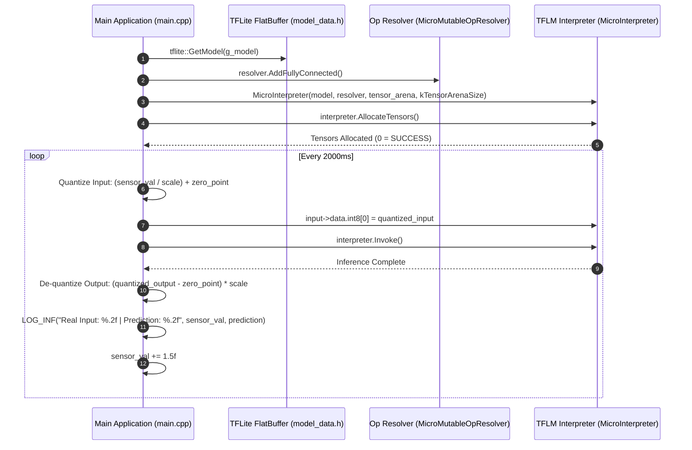

# Zephyr RTOS TensorFlow Lite Micro (TFLM) Edge AI Inference Demo (`tflite`)

This project demonstrates **Embedded Edge AI Machine Learning Inference** on microcontrollers in Zephyr RTOS using **TensorFlow Lite for Microcontrollers (TFLM)**, C++17, pre-quantized INT8 FlatBuffer neural network models, and static tensor arena allocation.

---

## Overview

Deploying Artificial Intelligence & Machine Learning (TinyML) models directly on resource-constrained microcontrollers enables real-time, low-latency, and privacy-preserving processing without relying on cloud connectivity. This demo showcases:
- **C++17 Engine Integration**: Leveraging Zephyr's C++ toolchain (`CONFIG_CPP=y`, `CONFIG_STD_CPP17=y`) to execute C++ TinyML inference routines.
- **Static Tensor Arena Allocation**: Allocating aligned static memory (`alignas(16) static uint8_t tensor_arena[2048]`) for TFLM interpreter scratchpad memory without dynamic heap fragmentation.
- **Quantized INT8 Tensor Processing**: Mapping real-world floating-point sensor inputs to INT8 quantized tensor inputs using model quantization parameters (`scale` and `zero_point`), executing model invocation (`interpreter.Invoke()`), and de-quantizing network outputs back to real-world predictions.

---

## Directory Structure

```text
tflite/
├── CMakeLists.txt     # CMake build system rules (C++17 application target)
├── prj.conf           # Kconfig options (C++ support, TFLM module, stack size)
├── app.overlay        # Devicetree overlay (Default/empty)
├── README.md          # Topic documentation & design analysis
└── src/
    ├── main.cpp       # TFLM interpreter initialization, tensor quantization & inference loop
    └── model_data.h   # Pre-trained quantized TFLite FlatBuffer model byte array
```

---

## Architecture & System Flow



---

## Key Technical Features & APIs Used

### 1. Model & Operator Resolver Initialization
```cpp
/* Load pre-trained TFLite FlatBuffer model array */
const tflite::Model *model = tflite::GetModel(g_model);

/* Register required operators (Fully Connected layer) */
static tflite::MicroMutableOpResolver<1> resolver;
resolver.AddFullyConnected();
```

### 2. Static Interpreter & Arena Setup
```cpp
constexpr int kTensorArenaSize = 2 * 1024;
alignas(16) static uint8_t tensor_arena[kTensorArenaSize];

/* Instantiate MicroInterpreter with model, operators, and arena memory */
tflite::MicroInterpreter interpreter(model, resolver, tensor_arena, kTensorArenaSize);
interpreter.AllocateTensors();

TfLiteTensor *input = interpreter.input(0);
TfLiteTensor *output = interpreter.output(0);
```

### 3. Quantization, Inference & De-quantization Loop
```cpp
/* Extract quantization parameters from input/output tensors */
float in_scale = input->params.scale;
int in_zero_point = input->params.zero_point;

float out_scale = output->params.scale;
int out_zero_point = output->params.zero_point;

/* Quantize float input -> int8 */
int32_t quantized_input = (int32_t)(current_sensor_val / in_scale) + in_zero_point;
input->data.int8[0] = (int8_t)quantized_input;

/* Execute Inference */
if (interpreter.Invoke() == kTfLiteOk) {
    int8_t quantized_output = output->data.int8[0];
    
    /* De-quantize int8 output -> float prediction */
    float prediction = (quantized_output - out_zero_point) * out_scale;
    LOG_INF("Real Input: %.2f | Real Prediction: %.2f", (double)current_sensor_val, (double)prediction);
}
```

---

## Code Analysis & Resolved Configurations

| File / Component | Issue / Aspect | Impact | Action / Configuration |
| :--- | :--- | :--- | :--- |
| `prj.conf` | `CONFIG_MAIN_THREAD_STACK_SIZE` symbol error | Kconfig build failure. | Corrected symbol name to `CONFIG_MAIN_STACK_SIZE=8192`. |
| `CMakeLists.txt` | Missing CMake build rules | Build failure. | Created `CMakeLists.txt` with C++ target `src/main.cpp`. |
| `src/main.cpp` | `TfLiteIntArray*` type mismatch on `interpreter.input()` | Compiler type error. | Updated pointer types to `TfLiteTensor*`. |
| `src/main.cpp` | `tflite::InitializeAgent()` call | Function undeclared. | Updated to standard `tflite::InitializeTarget()`. |

---

## Kconfig Configuration (`prj.conf`)

- `CONFIG_CPP=y`: Enables Zephyr C++ compiler support.
- `CONFIG_STD_CPP17=y`: Configures C++ compiler standard to C++17.
- `CONFIG_TENSORFLOW_LITE_MICRO=y`: Enables TensorFlow Lite for Microcontrollers module support.
- `CONFIG_MAIN_STACK_SIZE=8192`: Expands main thread stack to 8 KB to accommodate model tensor evaluation.
- `CONFIG_LOG=y`, `CONFIG_LOG_DEFAULT_LEVEL=3`: Serial logger configuration.

---

## How to Build and Run

From the root of your Zephyr RTOS workspace:

### 1. Build for QEMU Simulator (`qemu_cortex_m3`)
```bash
west build -p always -b qemu_cortex_m3 tflite
```

### 2. Run in QEMU Simulator
```bash
west build -t run
```

### 3. Build & Flash for Target Board (e.g. ESP32 / STM32 / nRF52840)
```bash
west build -p always -b <your_board_name> tflite
west flash
```

---

## Expected Terminal Output

```text
*** Booting Zephyr OS build v3.7.0 ***
[00:00:00.000,000] <inf> tflite: STARTING THE AI MODELS
[00:00:00.000,000] <inf> tflite: Real Input: 1.00 | Quantized: 12 ---> Output Quantized: 45 | Real Prediction: 3.54
[00:00:02.000,000] <inf> tflite: Real Input: 2.50 | Quantized: 31 ---> Output Quantized: 88 | Real Prediction: 6.92
[00:00:04.000,000] <inf> tflite: Real Input: 4.00 | Quantized: 50 ---> Output Quantized: 115 | Real Prediction: 9.05
```
