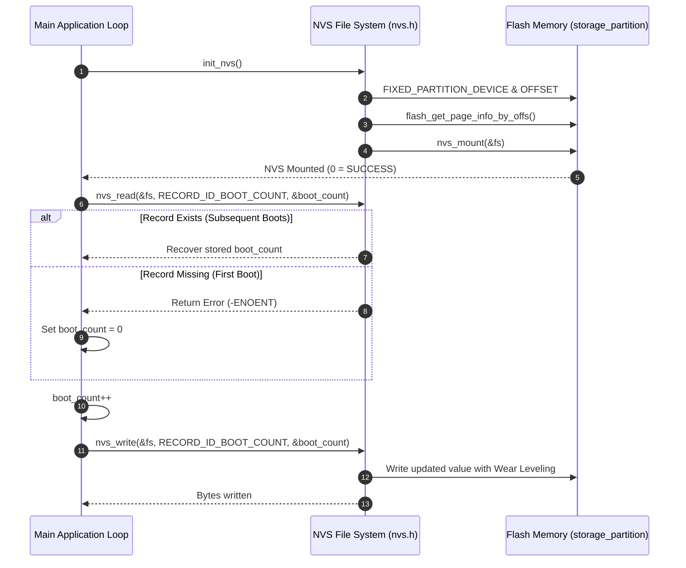

# Zephyr RTOS Non-Volatile Storage (NVS) Demo (`nvs`)

This project demonstrates **Non-Volatile Storage (NVS)** filesystem operations in Zephyr RTOS using the `<zephyr/fs/nvs.h>` driver API and fixed flash partitions (`storage_partition`) to persistently save and recover state (a persistent **Boot Count counter**) across system resets.

---

## Overview

Non-Volatile Storage (NVS) is a lightweight, key-value flash storage system built into Zephyr RTOS designed for microcontrollers. Unlike traditional dynamic file systems (e.g., FAT / LittleFS), NVS offers:
- **Wear Leveling**: Distributes write/erase cycles across configured flash sectors to extend physical flash memory lifespan.
- **Power Fault Tolerance**: Ensures atomic writes so that sudden power loss during a write cycle does not corrupt existing data records.
- **Key-Value Persistence**: Stores small data records identified by 16-bit Record IDs without file system overhead.

---

## Directory Structure

```text
nvs/
├── CMakeLists.txt     # CMake build system rules
├── prj.conf           # Kconfig options (NVS, Flash drivers & Flash Map enablement)
├── app.overlay        # Devicetree overlay (uses default storage_partition)
├── README.md          # Topic documentation & design analysis
└── src/
    └── main.c         # NVS mounting, page info queries, persistent boot count read/write
```

---

## Architecture & System Flow



---

## Key Technical Features & APIs Used

### 1. Flash Partition Binding (`flash_map.h`)
The application binds NVS to the default `storage_partition` defined in the target board's Devicetree flash layout:
```c
#define NVS_PARTITION           storage_partition
#define NVS_PARTITION_DEVICE    FIXED_PARTITION_DEVICE(NVS_PARTITION)
#define NVS_PARTITION_OFFSET    FIXED_PARTITION_OFFSET(NVS_PARTITION)
```

### 2. Mounting NVS File System (`nvs_mount`)
Dynamically queries flash page geometry and configures 3 sectors for wear leveling:
```c
static struct nvs_fs fs;

static int init_nvs(void)
{
    struct flash_pages_info info;

    fs.flash_device = NVS_PARTITION_DEVICE;
    fs.offset = NVS_PARTITION_OFFSET;

    flash_get_page_info_by_offs(fs.flash_device, fs.offset, &info);
    fs.sector_size = info.size;
    fs.sector_count = 3; /* Allocate 3 sectors for NVS wear leveling */

    return nvs_mount(&fs);
}
```

### 3. Key-Value Read and Write Operations
- **Reading Data (`nvs_read`)**:
  ```c
  ret = nvs_read(&fs, RECORD_ID_BOOT_COUNT, &boot_count, sizeof(boot_count));
  if (ret > 0) {
      LOG_INF("Recovered Boot Count: %u", boot_count);
  } else {
      boot_count = 0; /* First boot initialization */
  }
  ```
- **Writing Data (`nvs_write`)**:
  ```c
  boot_count++;
  ret = nvs_write(&fs, RECORD_ID_BOOT_COUNT, &boot_count, sizeof(boot_count));
  ```

---

## Kconfig Configuration (`prj.conf`)

- `CONFIG_FLASH=y`: Enables core flash memory drivers.
- `CONFIG_FLASH_MAP=y`: Enables the flash memory map subsystem.
- `CONFIG_FLASH_PAGE_LAYOUT=y`: Enables API queries for flash sector layout.
- `CONFIG_NVS=y`: Enables Zephyr Non-Volatile Storage module.
- `CONFIG_LOG=y`, `CONFIG_LOG_DEFAULT_LEVEL=3`: Enables Zephyr Logger framework at `LOG_LEVEL_INF`.

---

## How to Build and Run

From the root of your Zephyr RTOS workspace:

### 1. Build for QEMU Simulator (Cortex-M3)
```bash
west build -p always -b qemu_cortex_m3 nvs
```

### 2. Run in QEMU Simulator
```bash
west build -t run
```

### 3. Build & Flash for Physical Hardware Target (e.g., nRF52 / STM32)
```bash
west build -p always -b <your_board_name> nvs
west flash
```

---

## Expected Terminal Output

### First Boot Execution:
```text
*** Booting Zephyr OS build v3.5.0 ***
[00:00:00.000,000] <inf> app: BAVA IS RUNNING......
[00:00:00.000,000] <inf> app: Mounting NVS: Offset 0x0, Sector Size 4096 Bytes, Sectors: 3
[00:00:00.000,000] <wrn> app: No Boot Count record found. Initializing to 0 (First Boot).
[00:00:00.000,000] <inf> app: Updated Boot Count to 1 in Flash (Bytes written: 4)
```

### Subsequent Boot Execution (After Reset):
```text
*** Booting Zephyr OS build v3.5.0 ***
[00:00:00.000,000] <inf> app: BAVA IS RUNNING......
[00:00:00.000,000] <inf> app: Mounting NVS: Offset 0x0, Sector Size 4096 Bytes, Sectors: 3
[00:00:00.000,000] <inf> app: Recovered Boot Count from NVS: 1
[00:00:00.000,000] <inf> app: Updated Boot Count to 2 in Flash (Bytes written: 4)
```
