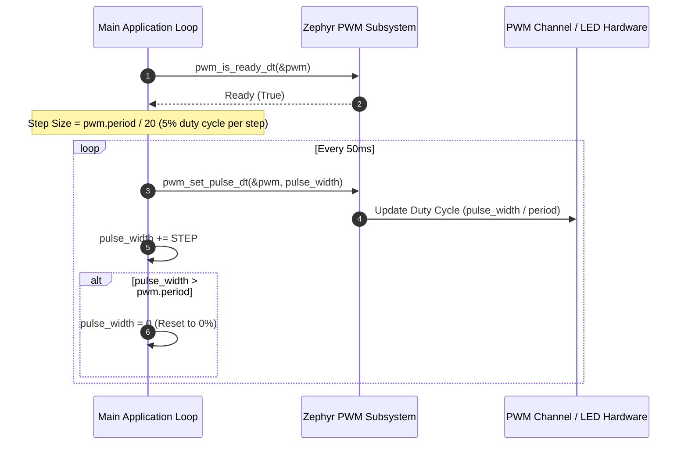

# Zephyr RTOS PWM LED Fading & Control Demo (`pwm`)

This project demonstrates **Pulse-Width Modulation (PWM)** signal generation in Zephyr RTOS using Devicetree overlays (`pwm_dt_spec`), `pwm-leds` driver bindings, and the high-level `pwm_set_pulse_dt` API to create a dynamic LED fading ("breathing") effect.

---

## Overview

Pulse-Width Modulation (PWM) is a standard technique used in embedded systems to control power delivered to load devices—such as dimming LEDs, controlling servo motor angles, or driving motor speeds—by varying the signal duty cycle at a fixed frequency. This demo showcases:
- **Devicetree Hardware Abstraction**: Binding a PWM LED channel to a PWM controller (`&ledc0`) with a period of `20 ms` (50 Hz frequency) and normal polarity.
- **Dynamic Pulse Width Calculation**: Automatically computing 5% duty cycle step increments based on `pwm.period`.
- **PWM Fading Loop**: Incrementally increasing the duty cycle from 0% to 100% every `50 ms` before resetting.

---

## Directory Structure

```text
pwm/
├── CMakeLists.txt     # CMake build system rules
├── prj.conf           # Kconfig options (PWM driver subsystem & Zephyr Logger)
├── app.overlay        # Devicetree overlay defining pwm-leds node & channel configuration
├── README.md          # Topic documentation & design analysis
└── src/
    └── main.c         # PWM spec retrieval, device readiness check & duty cycle fading loop
```

---

## Architecture & System Flow



---

## Key Technical Features & APIs Used

### 1. Devicetree PWM LED Overlay (`app.overlay`)
Defines a `pwm-leds` node mapped to the `led` alias:
```dts
#include <zephyr/dt-bindings/pwm/pwm.h>

/{
    aliases {
        led = &pwm_led;
    };

    pwmleds {
        compatible = "pwm-leds";
        pwm_led: pwm-led@0 {
            pwms = <&ledc0 0 PWM_MSEC(20) PWM_POLARITY_NORMAL>;
        };
    };
};

&ledc0 {
    status = "okay";
};
```
- `&ledc0`: Pointer to the underlying PWM hardware controller peripheral.
- `0`: PWM channel index.
- `PWM_MSEC(20)`: Signal period specified in milliseconds (20 ms = 50 Hz).
- `PWM_POLARITY_NORMAL`: High pulse active polarity.

### 2. PWM Specification Retrieval (`pwm_dt_spec`)
`PWM_DT_SPEC_GET` retrieves the complete configuration (controller device pointer, channel, period in nanoseconds, and flags) from Devicetree:
```c
#define PWM DT_ALIAS(led)

static const struct pwm_dt_spec pwm = PWM_DT_SPEC_GET(PWM);
```

### 3. Dynamic Fading & Pulse Width Adjustment
```c
#define STEP (pwm.period / 20) /* 5% duty cycle step */

int main(void)
{
    uint32_t pulse_width = 0;

    if (!pwm_is_ready_dt(&pwm)) {
        LOG_ERR("PWM controller device is not ready!");
        return -ENODEV;
    }

    while (1) {
        ret = pwm_set_pulse_dt(&pwm, pulse_width);
        if (ret < 0) {
            LOG_ERR("Failed to set pulse width");
            return ret;
        }

        pulse_width += STEP;

        if (pulse_width > pwm.period) {
            pulse_width = 0;
        }

        k_msleep(50);
    }
}
```

---

## Kconfig Configuration (`prj.conf`)

- `CONFIG_PWM=y`: Enables the Zephyr PWM driver subsystem and APIs.
- `CONFIG_LOG=y`: Enables Zephyr Logger framework.
- `CONFIG_LOG_DEFAULT_LEVEL=3`: Sets default log level to `LOG_LEVEL_INF`.
- `CONFIG_SERIAL=y`, `CONFIG_CONSOLE=y`, `CONFIG_UART_CONSOLE=y`: Directs log output to UART serial console.

---

## How to Build and Run

From the root of your Zephyr RTOS workspace:

### 1. Build for Target Hardware (e.g., ESP32 / STM32 / nRF52)
```bash
west build -p always -b <your_board_name> pwm
```

### 2. Build & Flash
```bash
west flash
```

---

## Expected Behavior

When flashed onto a board connected to a PWM-capable LED pin:
1. The LED will start completely OFF (`0%` duty cycle).
2. Every `50 ms`, the LED brightness will visibly increase by `5%`.
3. After 1 second (20 steps = `100%` duty cycle / full brightness), the LED resets to `0%` brightness and repeats the breathing cycle continuously.
