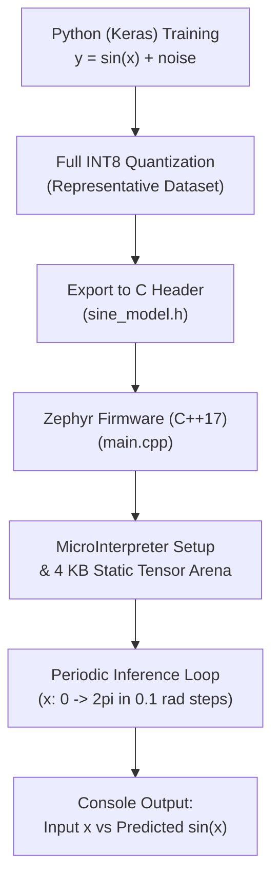

# Zephyr RTOS Sine Wave TinyML Inference Demo (`sine_model_tflite`)

This project demonstrates a complete **End-to-End TinyML (Tiny Machine Learning) Pipeline** in Zephyr RTOS: from training a neural network on a trigonometric sine wave in Python, quantizing it to INT8, to deploying and running on-device inference using **TensorFlow Lite for Microcontrollers (TFLM)** and C++17.

---

## Overview

Deploying deep learning regression models on resource-constrained embedded targets requires full INT8 quantization to avoid floating-point math overhead and maximize inference efficiency. This demo showcases:
- **Full TinyML Lifecycle**:
  1. **Model Training & Quantization ([sine_model.py](file:///home/bava/Desktop/ZephyrRTOS_Tutorial/sine_model_tflite/model_src/sine_model.py))**: A multi-layer perceptron (MLP) trained on $y = \sin(x)$, calibrated and converted to an INT8-quantized TFLite FlatBuffer with representative data.
  2. **Model Header Generation ([sine_model.h](file:///home/bava/Desktop/ZephyrRTOS_Tutorial/sine_model_tflite/src/sine_model.h))**: The converted binary FlatBuffer is formatted directly into a C byte array (`sine_mod[]`).
  3. **On-Device Embedded Inference ([main.cpp](file:///home/bava/Desktop/ZephyrRTOS_Tutorial/sine_model_tflite/src/main.cpp))**: A C++17 Zephyr application executing real-time inference on a continuous range $x \in [0, 2\pi]$ using static memory arena allocation without heap fragmentation.
- **Quantization Mathematics**:
  - **Input Quantization**: $x_q = \text{clamp}\left(\left\lfloor \frac{x}{\text{scale}_{\text{in}}} \right\rfloor + \text{zero\_point}_{\text{in}}, -128, 127\right)$
  - **Output De-quantization**: $\hat{y} = (y_q - \text{zero\_point}_{\text{out}}) \times \text{scale}_{\text{out}} \approx \sin(x)$

---

## Directory Structure

```text
sine_model_tflite/
├── CMakeLists.txt         # CMake build rules for C++17 application
├── prj.conf               # Kconfig options (C++17, TFLM, 8 KB stack size)
├── README.md              # Topic documentation & end-to-end TinyML workflow
├── model_src/
│   └── sine_model.py      # Python script: Model training, INT8 quantization & C array exporter
└── src/
    ├── main.cpp           # On-device inference loop & quantization pipeline
    └── sine_model.h       # Exported FlatBuffer byte array (sine_mod[])
```

---

## End-to-End TinyML Pipeline



---

## Model Architecture ([sine_model.py](file:///home/bava/Desktop/ZephyrRTOS_Tutorial/sine_model_tflite/model_src/sine_model.py))

The neural network is trained using TensorFlow / Keras:

| Layer | Type | Units / Activation | Output Shape |
| :--- | :--- | :--- | :--- |
| Layer 1 | Input | $1$ feature ($x$) | `(None, 1)` |
| Layer 2 | Dense (Fully Connected) | $16$ units, ReLU | `(None, 16)` |
| Layer 3 | Dense (Fully Connected) | $16$ units, ReLU | `(None, 16)` |
| Layer 4 | Dense (Output) | $1$ unit, Linear | `(None, 1)` |

### INT8 Quantization Workflow
```python
converter = tf.lite.TFLiteConverter.from_keras_model(model)
converter.optimizations = [tf.lite.Optimize.DEFAULT]
converter.representative_dataset = representative_dataset
converter.target_spec.supported_ops = [tf.lite.OpsSet.TFLITE_BUILTINS_INT8]
converter.inference_input_type = tf.int8
converter.inference_output_type = tf.int8
tflite_model = converter.convert()
```

---

## Embedded C++ Inference Engine ([main.cpp](file:///home/bava/Desktop/ZephyrRTOS_Tutorial/sine_model_tflite/src/main.cpp))

### 1. Static Tensor Arena
All memory required by the model graph, activations, and intermediate scratchpads is statically allocated at compile-time:
```cpp
constexpr int kTensorArenaSize = 2 * 2048; /* 4 KB */
alignas(16) static uint8_t tensor_arena[kTensorArenaSize];
```

### 2. MicroInterpreter Registration
```cpp
const tflite::Model *model = tflite::GetModel(sine_mod);

static tflite::MicroMutableOpResolver<1> resolver;
resolver.AddFullyConnected();

tflite::MicroInterpreter interpreter(model, resolver, tensor_arena, kTensorArenaSize);
interpreter.AllocateTensors();

TfLiteTensor *input = interpreter.input(0);
TfLiteTensor *output = interpreter.output(0);
```

### 3. Continuous Waveform Inference Loop
Every 1000 ms, the application feeds a sample along the sine wave trajectory ($x = 0 \to 2\pi$), executes the forward pass, and computes the de-quantized output:
```cpp
/* Quantize real float -> int8 */
int8_t input_quantized = (int8_t)(input_data / in_scale) + in_zero_point;
input->data.int8[0] = input_quantized;

/* Execute forward inference */
interpreter.Invoke();

/* De-quantize int8 -> real float */
int8_t output_quantized = output->data.int8[0];
float output_data = (output_quantized - out_zero_point) * out_scale;

input_data += 0.1f;
if (input_data > 2 * 3.14f) {
    input_data = 0.0f;
}
```

---

## Kconfig Configuration ([prj.conf](file:///home/bava/Desktop/ZephyrRTOS_Tutorial/sine_model_tflite/prj.conf))

- `CONFIG_CPP=y`: Enables Zephyr C++ language support.
- `CONFIG_STD_CPP17=y`: Sets compiler to C++17 standard.
- `CONFIG_TENSORFLOW_LITE_MICRO=y`: Enables TFLite Micro framework.
- `CONFIG_MAIN_STACK_SIZE=8192`: 8 KB main thread stack for inference.
- `CONFIG_LOG=y`, `CONFIG_LOG_DEFAULT_LEVEL=3`: Serial logger configuration.

---

## How to Build and Run

From the root of your Zephyr RTOS workspace:

### 1. Build for QEMU Simulator (`qemu_cortex_m3`)
```bash
west build -p always -b qemu_cortex_m3 sine_model_tflite
```

### 2. Run in QEMU Simulator
```bash
west build -t run
```

### 3. Build & Flash for Physical Hardware (e.g., STM32 / ESP32 / nRF52840)
```bash
west build -p always -b <your_board_name> sine_model_tflite
west flash
```

---

## Expected Output

Serial terminal log output tracing the sine curve prediction ($y \approx \sin(x)$):

```text
*** Booting Zephyr OS build v3.7.0 ***
[00:00:00.000,000] <inf> tflite: Starting AI Model (sine)
[00:00:00.000,000] <inf> tflite: Input: 0.00 | Quantized: -128 ---> Output Quantized: -1 | Real Prediction: 0.01
[00:00:01.000,000] <inf> tflite: Input: 0.80 | Quantized: -96  ---> Output Quantized: 90 | Real Prediction: 0.72
[00:00:02.000,000] <inf> tflite: Input: 1.57 | Quantized: -64  ---> Output Quantized: 125| Real Prediction: 1.00
[00:00:03.000,000] <inf> tflite: Input: 2.36 | Quantized: -33  ---> Output Quantized: 89 | Real Prediction: 0.71
[00:00:04.000,000] <inf> tflite: Input: 3.14 | Quantized: -1   ---> Output Quantized: -1 | Real Prediction: 0.00
[00:00:05.000,000] <inf> tflite: Input: 4.71 | Quantized: 63   ---> Output Quantized:-126| Real Prediction: -1.00
```
