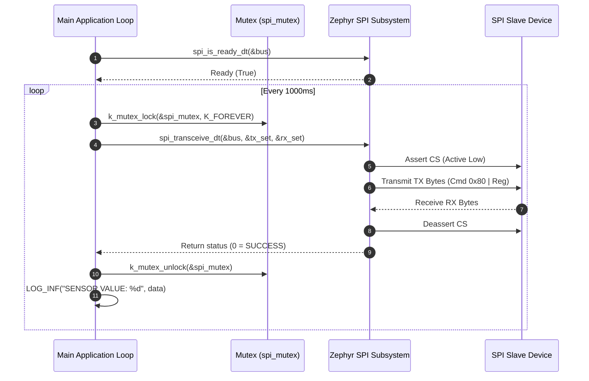

# Zephyr RTOS SPI Master & Sensor Interface Demo (`spi`)

This project demonstrates **SPI Bus Master Communication** in Zephyr RTOS using **Devicetree Specifications (`spi_dt_spec`)**, **Thread-Safe Bus Access (`k_mutex`)**, and full-duplex transceiver operations via `spi_transceive_dt`.

---

## Overview

Serial Peripheral Interface (SPI) is a synchronous, high-speed, full-duplex serial protocol commonly used for high-bandwidth sensors, displays, and external flash memories. This demo showcases:
- **Devicetree SPI Device Binding**: Defining an SPI peripheral node (`vnd,spi-device`) attached to an SPI controller bus with explicit Chip-Select (`cs-gpios`), max frequency (`1 MHz`), and clock mode settings.
- **Buffer Descriptor Management**: Utilizing `spi_buf` and `spi_buf_set` arrays for structured transmit (TX) and receive (RX) buffer management.
- **Thread-Safe Bus Locking**: Securing SPI bus transactions inside a `k_mutex` critical section to prevent bus contention in multithreaded applications.

---

## Directory Structure

```text
spi/
├── CMakeLists.txt     # CMake build rules for the SPI application
├── prj.conf           # Kconfig options (SPI subsystem, Zephyr Logger)
├── app.overlay        # Devicetree overlay defining SPI bus controller & slave device
├── README.md          # Topic documentation & design analysis
└── src/
    └── main.c         # SPI spec instantiation, buffer setup, mutex-protected transceive loop
```

---

## Architecture & System Flow



---

## Key Technical Features & APIs Used

### 1. Devicetree Configuration (`app.overlay`)
Binds an SPI child node (`sen_spi`) to an SPI controller (`&spi2` / board SPI node) with chip-select GPIO configuration:
```dts
#include <zephyr/dt-bindings/gpio/gpio.h>
#include <zephyr/dt-bindings/spi/spi.h>

/{
    aliases {
        sensor = &sen_spi;
    };
};

&spi2 {
    status = "okay";
    cs-gpios = <&gpio0 5 GPIO_ACTIVE_LOW>;

    sen_spi: sensor@0 {
        compatible = "vnd,spi-device";
        reg = <0>;

        spi-max-frequency = <1000000>;
        duplex = <SPI_FULL_DUPLEX>;
        frame-format = <SPI_FRAME_FORMAT_MOTOROLA>;
    };
};
```

### 2. SPI Spec Instantiation (`SPI_DT_SPEC_GET`)
```c
#define SPI DT_ALIAS(sensor)

static const struct spi_dt_spec bus = SPI_DT_SPEC_GET(SPI,
    SPI_WORD_SET(8) | SPI_OP_MODE_MASTER | SPI_TRANSFER_MSB, 
    0
);
```

### 3. Full-Duplex Transceive Operation (`spi_transceive_dt`)
TX and RX data are wrapped in `spi_buf` array descriptors and passed to `spi_transceive_dt`:
```c
int read_register(uint8_t id, uint8_t *var)
{
    uint8_t tx_cmd[2] = { id | 0x80, 0x00 };
    uint8_t rx_cmd[2] = { 0x00, 0x00 };

    struct spi_buf tx_buf = { .buf = tx_cmd, .len = sizeof(tx_cmd) };
    struct spi_buf rx_buf = { .buf = rx_cmd, .len = sizeof(rx_cmd) };

    struct spi_buf_set tx_set = { .buffers = &tx_buf, .count = 1 };
    struct spi_buf_set rx_set = { .buffers = &rx_buf, .count = 1 };

    k_mutex_lock(&spi_mutex, K_FOREVER);
    int ret = spi_transceive_dt(&bus, &tx_set, &rx_set);
    k_mutex_unlock(&spi_mutex);

    if (ret == 0) {
        *var = rx_cmd[1];
    }
    return ret;
}
```

---

## Kconfig Configuration (`prj.conf`)

- `CONFIG_SPI=y`: Enables the Zephyr SPI driver subsystem.
- `CONFIG_LOG=y`: Enables the Zephyr Logging subsystem.
- `CONFIG_LOG_DEFAULT_LEVEL=3`: Sets default log output level to `LOG_LEVEL_INF`.
- `CONFIG_SERIAL=y`, `CONFIG_CONSOLE=y`, `CONFIG_UART_CONSOLE=y`: Routes console output over UART.

---

## How to Build and Run

From the root of your Zephyr RTOS workspace:

### 1. Build for Supported Target Board (e.g., nRF52840 DK)
```bash
west build -p always -b nrf52840dk_nrf52840 spi
```

### 2. Build for ENE Evaluation Board (`kb1200_evb`)
```bash
west build -p always -b kb1200_evb spi
```

### 3. Build for QEMU Simulator (`qemu_cortex_m3`)
```bash
west build -p always -b qemu_cortex_m3 spi
west build -t run
```

---

## Troubleshooting Common Errors

| Error Symptom | Cause | Solution |
| :--- | :--- | :--- |
| `Invalid BOARD` | Typo in board name argument (e.g. `qemu-cortex_m3` with hyphen). | Use exact board string: `qemu_cortex_m3` or `kb1200_evb` (underscores). |
| `undefined node label 'spi2'` | Target board DTS lacks node label `&spi2`. | Update `app.overlay` to match target board SPI node (e.g., `&spi0` or `&spi1`). |
| `cs-gpio parse error` | Typo in Devicetree property name. | Use `cs-gpios` (plural). |
