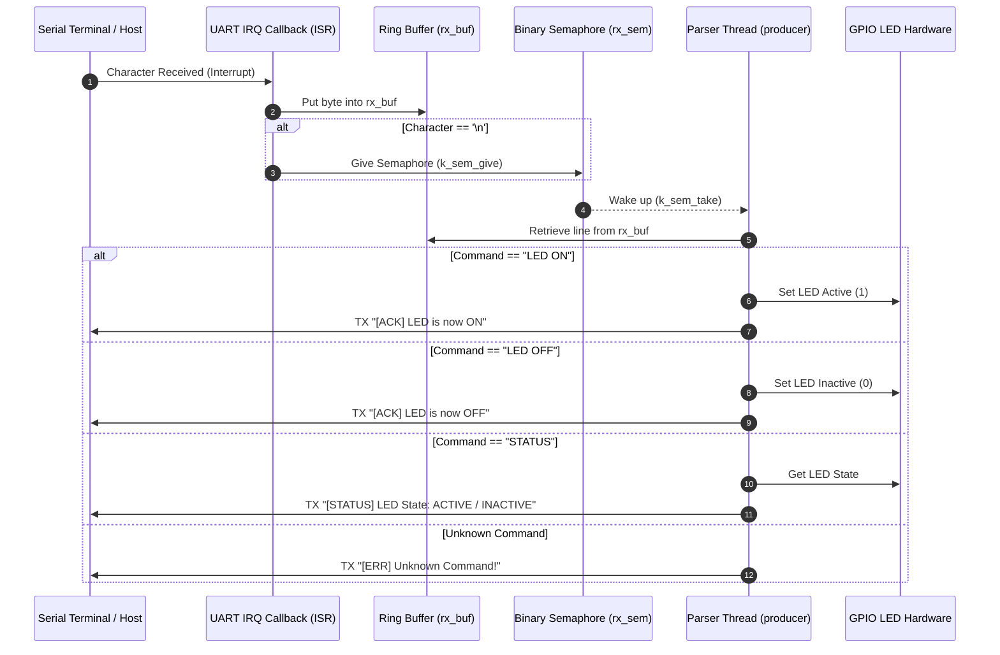

# Zephyr RTOS UART Command Parser & Interrupt Demo (`uart`)

This project demonstrates an **Interrupt-Driven UART Command Line Parser** in Zephyr RTOS using **UART Interrupts**, **Ring Buffers (`k_ring_buf`)**, **Binary Semaphores (`k_sem`)**, and dedicated **Multithreaded Command Processing** for GPIO LED control.

---

## Overview

In real-time embedded applications, processing UART communication byte-by-byte within an Interrupt Service Routine (ISR) or blocking the CPU waiting for incoming bytes is inefficient and bad practice. This demo showcases the **Deferred Processing Pattern**:
- **Interrupt Handling (ISR)**: Asynchronous UART RX interrupts read bytes non-blockingly into a lock-free **Ring Buffer** and signal a consumer thread when a complete newline (`\n`) frame is received.
- **Thread Decoupling**: A background parser thread processes complete text lines from the ring buffer outside ISR context, ensuring low interrupt latency.
- **Interactive Command Parser**: Case-insensitive CLI commands dynamically toggle and query the state of a GPIO LED with user feedback over UART.

---

## Directory Structure

```text
uart/
├── CMakeLists.txt     # CMake build rules for the UART application
├── prj.conf           # Kconfig options (Zephyr Logging subsystem)
├── app.overlay        # Devicetree overlay defining status LED & comm UART aliases
├── README.md          # Topic documentation & design analysis
└── src/
    └── main.c         # UART IRQ handler, Ring Buffer IPC & CLI Parser Thread
```

---

## Architecture & System Flow



---

## Key Technical Features & APIs Used

### 1. Devicetree Aliases & Hardware Mapping (`app.overlay`)
The project utilizes Devicetree aliases to isolate hardware definitions from main logic:
- `commuart`: Mapped to `&uart0` (`current-speed = 115200`).
- `led`: Mapped to `status-led` (`&gpio0 2 GPIO_ACTIVE_HIGH`).
- `chosen { zephyr,console = &uartdev; };` routes console logging output to UART0.

### 2. Interrupt-Driven UART Reception (`uart_irq_*`)
- **Callback Registration**: `uart_irq_callback_set(uart, uart_callback);`
- **Interrupt Enable**: `uart_irq_rx_enable(uart);`
- **ISR Handling**:
  ```c
  if (uart_irq_update(dev) && uart_irq_rx_ready(dev)) {
      uint8_t byte;
      while (uart_fifo_read(dev, &byte, 1) > 0) {
          ring_buf_put(&rx_buf, &byte, 1);
          if (byte == '\n') {
              k_sem_give(&rx_sem);
          }
      }
  }
  ```

### 3. Ring Buffer & Semaphore Synchronization
- **Ring Buffer (`K_RING_BUF_DECLARE`)**: Safely stores incoming raw bytes from ISR context without dynamic allocation.
- **Binary Semaphore (`K_SEM_DEFINE(rx_sem, 0, 1)`)**: Signals the parser thread when a full line (`\n`) has arrived.

### 4. Interactive CLI Parser Thread
Statically created using `K_THREAD_DEFINE` with priority `5`:
- Uses `strcasecmp` for case-insensitive matching (`LED ON`, `led on`, `Led On`).
- Outputs acknowledgement responses via `uart_poll_out`.
- Includes buffer overflow protection (resets line buffer if exceeded 254 bytes).

---

## Supported Commands

| Command | Case Sensitivity | Action | System Response |
| :--- | :--- | :--- | :--- |
| `LED ON` | Case-insensitive | Turns status LED ON | `[ACK] LED is now ON` |
| `LED OFF` | Case-insensitive | Turns status LED OFF | `[ACK] LED is now OFF` |
| `STATUS` | Case-insensitive | Queries current GPIO pin state | `[STATUS] LED State: ACTIVE` or `INACTIVE` |
| *Other* | N/A | Ignored with syntax prompt | `[ERR] Unknown Command! Use: LED ON \| LED OFF \| STATUS` |

---

## Kconfig Configuration (`prj.conf`)

- `CONFIG_LOG=y`: Enables Zephyr Logger subsystem.
- `CONFIG_LOG_MODE_IMMEDIATE=n`: Uses buffered/deferred logging to avoid stalling timing-critical operations.
- `CONFIG_LOG_DEFAULT_LEVEL=3`: Sets default log level to `LOG_LEVEL_INF`.

---

## How to Build and Run

From the root of your Zephyr RTOS workspace:

### 1. Build for QEMU Simulator (Cortex-M3)
```bash
west build -b qemu_cortex_m3 uart -p always
```

### 2. Run in QEMU Simulator
```bash
west build -t run
```

### 3. Build & Flash for Physical Hardware Target (e.g., nRF52 / STM32)
```bash
west build -b <your_board_name> uart
west flash
```

---

## Expected Output & Terminal Interaction

Upon booting, the serial terminal will prompt for input:

```text
*** Booting Zephyr OS build v3.5.0 ***
[00:00:00.000,000] <inf> app: PARSER STARTED
[init] LED Parser Ready
> STATUS
[STATUS] LED State: INACTIVE
> LED ON
[ACK] LED is now ON
> STATUS
[STATUS] LED State: ACTIVE
> LED OFF
[ACK] LED is now OFF
> invalid_cmd
[ERR] Unknown Command! Use: LED ON | LED OFF | STATUS
> 
```
