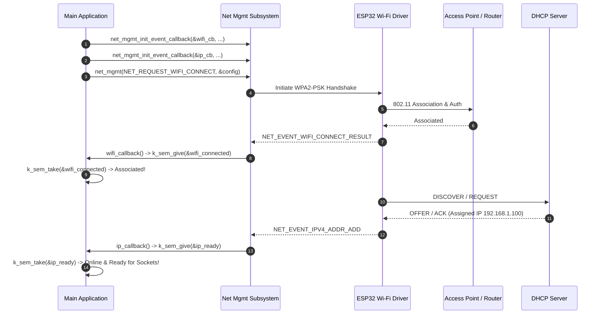

# Zephyr RTOS Wi-Fi Station & DHCP Networking Demo (`wifi`)

This project demonstrates **Wi-Fi Station Mode Connection** and **Automatic IPv4 DHCP Address Acquisition** in Zephyr RTOS using the Network Management API (`<zephyr/net/net_mgmt.h>`, `<zephyr/net/wifi_mgmt.h>`), L2 Wi-Fi Management, and Binary Semaphores (`k_sem`) for asynchronous synchronization.

---

## Overview

Wi-Fi is the primary wireless local area network (WLAN) protocol for high-throughput internet and local network connectivity in IoT edge nodes. This demo showcases:
- **Asynchronous Management Callbacks**: Registering `net_mgmt_event_callback` handlers to listen for Wi-Fi connection state events (`NET_EVENT_WIFI_CONNECT_RESULT`, `NET_EVENT_WIFI_DISCONNECT_RESULT`) and IP assignment events (`NET_EVENT_IPV4_ADDR_ADD`).
- **Station Mode AP Connection**: Initiating Wi-Fi WPA2-PSK connection requests using `net_mgmt(NET_REQUEST_WIFI_CONNECT, ...)` with parameters (`ssid`, `psk`, `security`, `band`).
- **DHCP Client IP Lease Acquisition**: Automatically requesting an IPv4 address lease upon Wi-Fi association via Zephyr's built-in DHCPv4 client stack (`CONFIG_NET_DHCPV4=y`).
- **Multithread Synchronization**: Blocking the application thread until Wi-Fi association succeeds, followed by blocking until DHCP assigns an IP address.

---

## Directory Structure

```text
wifi/
├── CMakeLists.txt     # CMake build system rules
├── prj.conf           # Kconfig options (Wi-Fi driver, L2 management, IPv4 & DHCPv4 stacks)
├── app.overlay        # Devicetree overlay (Default/empty)
├── README.md          # Topic documentation & design analysis
└── src/
    └── main.c         # Wi-Fi connection params, net_mgmt callbacks & DHCP wait sequence
```

---

## Architecture & System Flow



---

## Key Technical Features & APIs Used

### 1. Wi-Fi Connection Request (`wifi_connect_req_params`)
Configures target Access Point SSID, WPA2-PSK passphrase, 2.4 GHz frequency band, and security mode:
```c
#define SSID "your ssid"
#define PASSWORD "your password"

static int connect_wifi(struct net_if *iface)
{
    struct wifi_connect_req_params config = {
        .ssid = (const uint8_t *)SSID,
        .ssid_length = strlen(SSID),
        .psk = (const uint8_t *)PASSWORD,
        .psk_length = strlen(PASSWORD),
        .channel = WIFI_CHANNEL_ANY,
        .security = WIFI_SECURITY_TYPE_PSK,
        .band = WIFI_FREQ_BAND_2_4_GHZ,
        .mfp = WIFI_MFP_OPTIONAL,
    };

    return net_mgmt(NET_REQUEST_WIFI_CONNECT, iface, &config, sizeof(config));
}
```

### 2. Network Management Event Callbacks (`net_mgmt_init_event_callback`)
Initializes asynchronous callbacks for Wi-Fi association and DHCP IP assignment:
```c
static void wifi_callback(struct net_mgmt_event_callback *cb, uint32_t event, struct net_if *iface)
{
    if (event == NET_EVENT_WIFI_CONNECT_RESULT) {
        LOG_INF(">> [Wi-Fi] Connected to AP successfully!");
        k_sem_give(&wifi_connected);
    } else if (event == NET_EVENT_WIFI_DISCONNECT_RESULT) {
        LOG_WRN(">> [Wi-Fi] Disconnected from AP.");
    }
}

static void ip_callback(struct net_mgmt_event_callback *cb, uint32_t event, struct net_if *iface)
{
    if (event == NET_EVENT_IPV4_ADDR_ADD) {
        LOG_INF(">> [IPv4] IP Address assigned via DHCP!");
        k_sem_give(&ip_ready);
    }
}
```

### 3. Application Execution Flow
```c
int main(void)
{
    net_mgmt_init_event_callback(&wifi_cb, wifi_callback, 
                                 NET_EVENT_WIFI_CONNECT_RESULT | NET_EVENT_WIFI_DISCONNECT_RESULT);
    net_mgmt_add_event_callback(&wifi_cb);

    net_mgmt_init_event_callback(&ip_cb, ip_callback, NET_EVENT_IPV4_ADDR_ADD);
    net_mgmt_add_event_callback(&ip_cb);

    struct net_if *iface = net_if_get_default();
    connect_wifi(iface);

    k_sem_take(&wifi_connected, K_SECONDS(20));
    k_sem_take(&ip_ready, K_SECONDS(20));

    LOG_INF(">> Network is fully online and ready for socket communication!");
}
```

---

## Code Analysis & Bug Fixes Applied

| File / Line | Issue Description | Impact | Corrective Fix |
| :--- | :--- | :--- | :--- |
| `src/main.c:34` | **Assignment Warning**: `if(event = NET_EVENT_IPV4_ADDR_ADD)` | Evaluated to true unconditionally; assigned value to event parameter. | Corrected to equality check: `if (event == NET_EVENT_IPV4_ADDR_ADD)`. |
| `src/main.c:61` | **Macro Mismatch**: `net_mgmt_init_callback(&wifi_cb, ..., WIFI_SHELL_MGMT_EVENTS)` | Compiler error (`net_mgmt_init_callback` & `WIFI_SHELL_MGMT_EVENTS` undeclared). | Updated to standard API `net_mgmt_init_event_callback(&wifi_cb, ..., CONNECT_RESULT \| DISCONNECT_RESULT)`. |
| `src/main.c:74` | **Function Name Mismatch**: `connect_to_wifi(iface)` | Compilation error (`connect_to_wifi` undeclared). | Renamed invocation to `connect_wifi(iface)`. |
| `src/main.c:81` | **Semaphore Name Mismatch**: `&wifi_connected_sem` | Compilation error (`wifi_connected_sem` undeclared). | Renamed to defined semaphore `&wifi_connected`. |
| `src/main.c:87` | **Semaphore Name Mismatch**: `&ipv4_obtained_sem` | Compilation error (`ipv4_obtained_sem` undeclared). | Renamed to defined semaphore `&ip_ready`. |

---

## Kconfig Configuration (`prj.conf`)

- `CONFIG_WIFI=y`, `CONFIG_WIFI_ESP32=y`: Enables core Wi-Fi subsystem and ESP32 Wi-Fi driver.
- `CONFIG_NETWORKING=y`, `CONFIG_NET_L2_WIFI_MGMT=y`, `CONFIG_NET_L2_ETHERNET=y`: Enables L2 network management.
- `CONFIG_NET_IPV4=y`, `CONFIG_NET_DHCPV4=y`: Enables IPv4 stack and DHCPv4 client daemon.
- `CONFIG_NET_TCP=y`, `CONFIG_NET_UDP=y`, `CONFIG_NET_SOCKETS=y`: Enables POSIX Sockets.

---

## How to Build and Flash

From the root of your Zephyr RTOS workspace:

### 1. Build for ESP32 Target Board
```bash
west build -p always -b esp32_devkitc_wroom wifi
```

### 2. Flash to ESP32 Hardware
```bash
west flash
```

---

## Expected Output

Serial terminal log output upon booting:

```text
*** Booting Zephyr OS build v3.7.0 ***
[00:00:00.000,000] <inf> wifi_station: Starting Wi-Fi Station Demo...
[00:00:00.000,000] <inf> wifi_station: Waiting for Wi-Fi association...
[00:00:02.150,000] <inf> wifi_station: >> [Wi-Fi] Connected to AP successfully!
[00:00:02.150,000] <inf> wifi_station: Associated with AP. Requesting DHCP lease...
[00:00:03.420,000] <inf> wifi_station: >> [IPv4] IP Address assigned via DHCP!
[00:00:03.420,000] <inf> wifi_station: >> Network is fully online and ready for socket communication!
```
